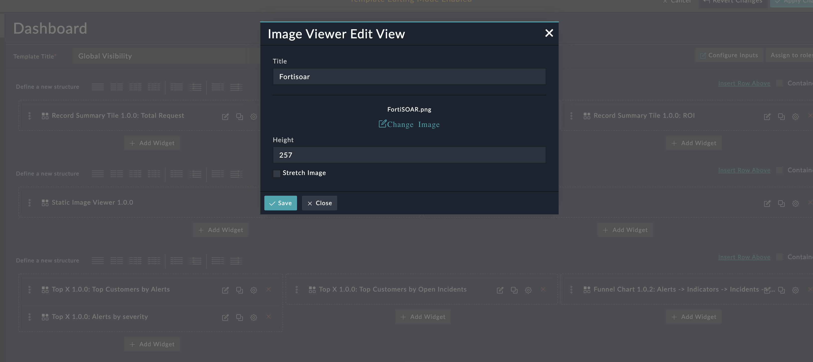

| [Home](../README.md) |
|----------------------|

# Usage

The FortiSOAR Image Viewer is a user-friendly widget that allows users to upload images and render them directly on their FortiSOAR dashboard. 

### Count of Records Across Modules
Edit a module's (e.g. *Dashboard*) view template and select **Add Widget** button.

Select **Static Image Viewer** from the list to bring up the **Static Image Viewer** widget's customization modal.

  

Image Upload: Users can easily upload images directly through the Image Viewer Widget. The widget supports various image formats, including JPEG, PNG, GIF, and more, ensuring compatibility with a wide range of image types.
User can either drag and drop an image or click to select an image from disk

Stretch :  The Image Viewer Widget offers the flexibility to stretch uploaded images to fit the widget's dimensions.

Height:  Users have the ability to specify the height of the Image Viewer Widget according to their preferences and dashboard layout requirements. This customization option allows users to allocate screen space appropriately and maintain a cohesive visual presentation.

| [Installation](./setup.md#installation) | [Configuration](./setup.md#configuration) |
|-----------------------------------------|-------------------------------------------|